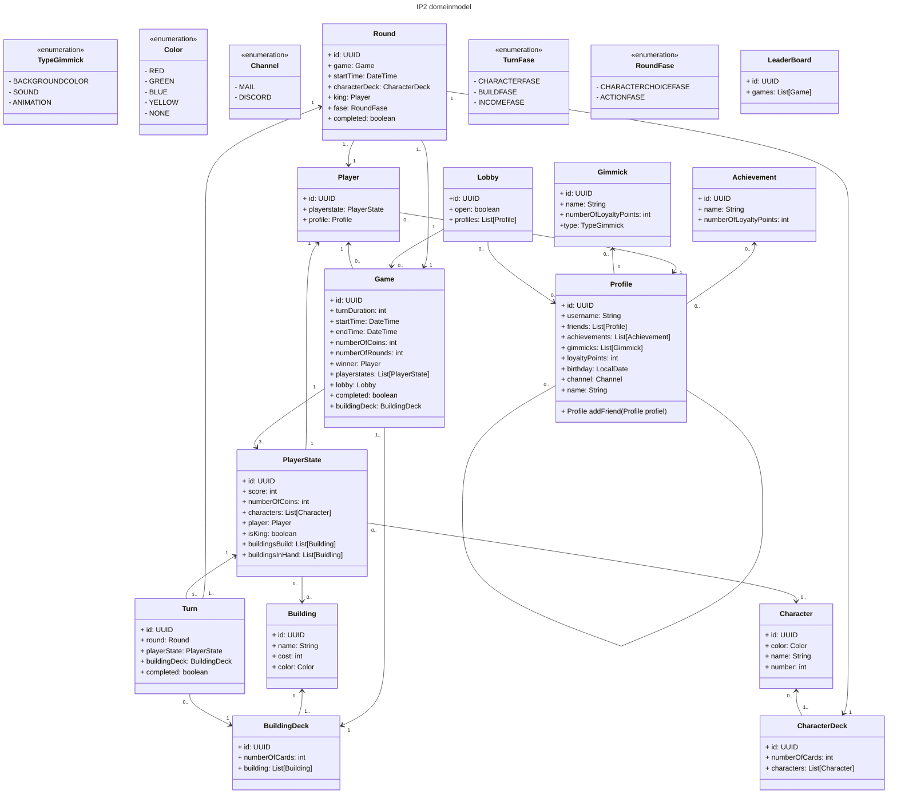

```mermaid
---
title: IP2 domeinmodel
---
classDiagram
class Achievement{
    + id: UUID
    + name: String
    + numberOfLoyaltyPoints: int
 }
 
 class Gimmick{
     + id: UUID
     + name: String
     + numberOfLoyaltyPoints: int
     +type: TypeGimmick
 }
 class TypeGimmick{
     <<enumeration>>
     - BACKGROUNDCOLOR
     - SOUND
     - ANIMATION
 }
    class Color{
        <<enumeration>>
        - RED
        - GREEN
        - BLUE
        - YELLOW
        - NONE
    }
class Character{
    + id: UUID
    + color: Color
    + name: String
    + number: int
}

class Channel{
    <<enumeration>>
    - MAIL
    - DISCORD
}

class Profile{
    + id: UUID
    + username: String
    + friends: List[Profile]
    + achievements: List[Achievement]
    + gimmicks: List[Gimmick]
    + loyaltyPoints: int
    + birthday: LocalDate
    + channel: Channel
    + name: String
    + Profile addFriend(Profile profiel)


}

class Player{
    + id: UUID
    + playerstate: PlayerState 
    + profile: Profile
}


class PlayerState{
    + id: UUID
    + score: int
    + numberOfCoins: int
    + characters: List[Character] 
    + player: Player
    + isKing: boolean
    + buildingsBuild: List[Building]
    + buildingsInHand: List[Buidling]
}


class Building{
    + id: UUID
    + name: String
    + cost: int
    + color: Color
    
 }
 class Lobby{
     +id: UUID
     + open: boolean
     + profiles: List[Profile]
 }
 
 
 class Game{
     + id: UUID
     + turnDuration: int
     + startTime: DateTime
     + endTime: DateTime
     + numberOfCoins: int 
     + numberOfRounds: int
     + winner: Player
     + playerstates: List[PlayerState]
     + lobby: Lobby
     + completed: boolean
     + buildingDeck: BuildingDeck
 }
 
 class Round{
     + id: UUID
     + game: Game
     + startTime: DateTime
     + characterDeck: CharacterDeck
     + king: Player
     + fase: RoundFase
     + completed: boolean
     
 }
 class TurnFase{
     <<enumeration>>
     - CHARACTERFASE
     - BUILDFASE
     - INCOMEFASE
 }
 
 class RoundFase{
     <<enumeration>>
     - CHARACTERCHOICEFASE
     - ACTIONFASE
 }
 
 class Turn{
     + id: UUID
     + round: Round
     + playerState: PlayerState
     + buildingDeck: BuildingDeck
     + completed: boolean
 }
 
 class CharacterDeck{
     + id: UUID
     + numberOfCards: int
     + characters: List[Character]
 }
 
 class BuildingDeck{
     + id: UUID
     + numberOfCards: int 
     + building: List[Building]
 }
 
 class LeaderBoard{
     + id: UUID
     + games: List[Game]
 }
 
  Achievement "0.." <-- "0.." Profile
  Player "0.." --> "1" Profile
  Gimmick "0.." <-- "0.." Profile
  Profile -- "0.." Profile 
  Player "1" <-- "1" PlayerState
  Game "1" --> "3.." PlayerState
  PlayerState "0.." --> "0.." Character
  PlayerState "0.." --> "0.." Building
  Round "1.." --> "1" Game
  Round "1.." --> "1" CharacterDeck
  Round "1.." --> "1" Player
  Game "1.." --> "1" BuildingDeck
  Round "1" <-- "1.." Turn
  PlayerState "1" <-- "1.." Turn
  Character "0.." <-- "1.." CharacterDeck
  Building "0.." <-- "1.." BuildingDeck
  Turn "0.." --> "1" BuildingDeck
  Lobby "0.." --> "0.." Profile
  Lobby "1" --> "0.." Game
  Player "1" <-- "0.." Game
  
  
  
  
```